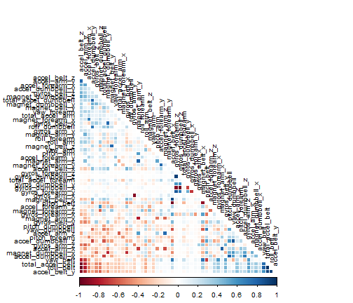

Practical Machine Learning Project
========================================================

Introduction
--------------------------------------------------------

Using devices such as Jawbone Up, Nike FuelBand, and Fitbit it is now possible to collect a large amount of data about personal activity. These type of devices are part of the quantified self movement - a group of enthusiasts who take measurements about themselves regularly to improve their health or to find patterns in their behavior. One thing that people regularly do is quantify how much of a particular activity they do, but they rarely quantify how well they do it. 

In this project, the purpose is to use data from acceerometers on the belt, forearm, arm, and dumbell of 6 participants and predict the manner in which people did the excercise.

The data is collected in a testing set and in a training with 160 variables.

Getting and cleaning the data
--------------------------------------------------------
The data is downloaded from internet and uploaded to R.

```r
#libraries
library(caret)
```

```
## Warning: package 'caret' was built under R version 3.1.3
```

```
## Loading required package: lattice
## Loading required package: ggplot2
```

```
## Warning: package 'ggplot2' was built under R version 3.1.3
```

```r
library(corrplot)
```

```
## Warning: package 'corrplot' was built under R version 3.1.3
```

```r
library(randomForest)
```

```
## Warning: package 'randomForest' was built under R version 3.1.3
```

```
## randomForest 4.6-12
## Type rfNews() to see new features/changes/bug fixes.
```

```r
#Download files
if (!file.exists("pmlTraining.csv")) {
        download.file("http://d396qusza40orc.cloudfront.net/predmachlearn/pml-training.csv", 
                      destfile = "pmlTraining.csv")
}
if (!file.exists("pmlTesting.csv")) {
        download.file("http://d396qusza40orc.cloudfront.net/predmachlearn/pml-testing.csv", 
                      destfile = "pmlTesting.csv")
}

#Data
pmlTraining <- read.csv("pmlTraining.csv", header = TRUE, na.strings = c("NA","#DIV/0!",""))
pmlTesting <- read.csv("pmlTesting.csv", header = TRUE, na.strings = c("NA","#DIV/0!",""))
```

To have a good prediction is required to get the variables with complete data. The next step is to take out the first seven variables because they do not contribute too much for the explanation and the columns full of missing values.


```r
indexNA <- as.vector(sapply(pmlTesting[,1:160],function(x) {length(which(is.na(x)))!=0}))
data_train <- pmlTraining[,!indexNA]
data_test <- pmlTesting[,!indexNA]
data_train<- data_train[,-(1:7)]
data_test <- data_test[,-(1:7)]
```

It is also required to take out the variables which are highly correlated to make a prediction model less biased.

```r
corMatrix<- cor(data_train[, -53])
diag(corMatrix) <- 0 
corrplot(corMatrix, order = "FPC", method = "color", type = "lower", tl.cex = 0.8, tl.col = rgb(0, 0, 0))
```

 

It is possible to see that some columns are highly correlated to each other in darker blue and darker red.


```r
# find the highly correlated variables
h_cor <- findCorrelation(cor(data_train[, -ncol(data_train)]), cutoff=0.9)

# remove highly correlated variables
data_train <- data_train[, -h_cor]
data_test <- data_test[, -h_cor]
```

One more step to make a good model is to center the data.

```r
# pre process variables
Obj <-preProcess(data_train[,1:(ncol(data_train)-1)],method=c('knnImpute', 'center', 'scale'))
data_sub_train <- predict(Obj, data_train[,1:(ncol(data_train)-1)])
data_sub_train$classe <- data_train$classe
data_sub_test <-predict(Obj,data_test[,1:(ncol(data_test)-1)])
data_sub_test$problem_id <- data_test$problem_id
```

Now, it is time to split the data into two datasets: training and validation. The first one collects the 80% of the data.


```r
inTrain <- createDataPartition(y = data_train$classe, p = 0.8, list = FALSE)
datasub_train <- data_sub_train[inTrain,]
datasub_valid <- data_sub_train[-inTrain,]
```

Model: Random Forest
--------------------------------------------------------
Random forests are useful algorithms to classify data. These kinds of models deal with nonlinearity of the data and they have robust results. In R, we have to use the function randomForest, as it follows:


```r
rf <- randomForest(classe ~ ., data=datasub_train)
rf
```

```
## 
## Call:
##  randomForest(formula = classe ~ ., data = datasub_train) 
##                Type of random forest: classification
##                      Number of trees: 500
## No. of variables tried at each split: 6
## 
##         OOB estimate of  error rate: 0.5%
## Confusion matrix:
##      A    B    C    D    E  class.error
## A 4460    3    0    0    1 0.0008960573
## B   13 3017    8    0    0 0.0069124424
## C    0   13 2723    2    0 0.0054784514
## D    0    0   28 2543    2 0.0116595414
## E    0    0    2    7 2877 0.0031185031
```

Then, it is required to make a prediction out of sample to test the accuracy.

```r
pred <- predict(rf, datasub_valid)
confus <- confusionMatrix(datasub_valid$classe, pred)
confus$table
```

```
##           Reference
## Prediction    A    B    C    D    E
##          A 1116    0    0    0    0
##          B    1  757    1    0    0
##          C    0    3  679    2    0
##          D    0    0    8  635    0
##          E    0    0    0    0  721
```
It has an acceptable accuracy.

```r
accur <- postResample(datasub_valid$classe, pred)
Accuracy <- accur[[1]]
Accuracy
```

```
## [1] 0.9961764
```

